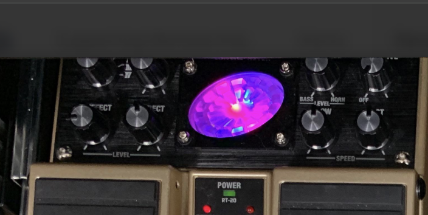

# 🎸 Gilmour Tones

**Reference settings for amps, pedals & signal chains** — Hiwatt, Bassman, Tube Driver, Big Muff, CE-2, and more. Sources: Kitrae, Gilmourish, and official documentation.

---

## Table of contents

- [Hiwatt](#hiwatt)
- [59 Bassman](#59-bassman)
- [Boss RE-20 & RT-20](#boss-re-20--rt-20)
- [Tube Driver](#tube-driver)
- [Big Muff](#big-muff)
- [CE-2 / Dyna Comp / CS-2](#ce-2--dyna-comp--cs-2)
- [Ambi Space & Signal Chains](#ambi-space--signal-chains)
- [WEM Super Starfinder 4×12](#wem-super-starfinder-4x12)
- [Josh Homme (QOTSA / TCV)](#josh-homme-qotsa--tcv)

---

## Hiwatt

### Kitrae's Custom 100 settings for 70s tones


<sub>Source: [kitrae.net — David Gilmour Amplifiers and Speakers](http://www.kitrae.net/music/David_Gilmour_Amplifiers_and_Speakers.html)</sub>

### Kitrae's Reeves Custom 50PS settings for 70s tones


<sub>Source: [kitrae.net — David Gilmour Amplifiers and Speakers](http://www.kitrae.net/music/David_Gilmour_Amplifiers_and_Speakers.html)</sub>

### Kitrae's Custom 100 settings for 1979–2015 tones


<sub>Source: [kitrae.net — David Gilmour Amplifiers and Speakers](http://www.kitrae.net/music/David_Gilmour_Amplifiers_and_Speakers.html)</sub>

### Kitrae's Reeves Custom 50PS settings for 1979–2015 tones


<sub>Source: [kitrae.net — David Gilmour Amplifiers and Speakers](http://www.kitrae.net/music/David_Gilmour_Amplifiers_and_Speakers.html)</sub>

> These settings should only be used as a starting point since the sound will vary depending on the type of speakers used. He has two of the inputs linked to combine the Normal and Brilliant channels, but he tends to keep the Brill channel volume lower than the Normal.

### Gilmour's Custom 100 — Dark Side of the Moon through The Wall era


<sub>Source: [kitrae.net — David Gilmour Hiwatt Settings](http://www.kitrae.net/music/David_Gilmour_Hiwatt_Settings.html)</sub>

> Actual studio Hiwatt DR-103 settings from the Dark Side of the Moon through The Wall era. The upper normal input and lower brilliant inputs were internally linked, which is why there is a dummy plug in the upper left input.

### Gilmour's Custom 100 — 2004 Strat Pack tones


<sub>Source: [kitrae.net — David Gilmour Hiwatt Settings](http://www.kitrae.net/music/David_Gilmour_Hiwatt_Settings.html)</sub>

> One DR-103 head was switched between a WEM 4×12 speaker cabinet and a Marshall 4×12 cab.

### Gilmour's Custom 100 — 2006 tour tones


<sub>Source: [kitrae.net — David Gilmour Hiwatt Settings](http://www.kitrae.net/music/David_Gilmour_Hiwatt_Settings.html)</sub>

> Based on the tic marks shown in the photos taken by Pete Cornish when he worked on the amps prior to the tour. The upper normal input and lower brilliant inputs are internally linked. Photos of the amp settings from the tour vary only slightly from these settings. Note that one DR-103 head powered a Marshall 4×12 speaker cabinet, and another a WEM 4×12 speaker cabinet. Settings were identical except the bass was set slightly higher for the WEM cabinet (gray line). Your Hiwatt settings will vary depending on the cabinet type, speaker type, and number of speakers used, so this should only be used as a starting point for your own settings.

### Gilmour's Custom 100 — 2015/2016 Rattle That Lock tour

```
Normal Vol:  2:00
Bril Vol:    12:30
Bass:        3:30
Treble:      8:30
Middle:      1:00
Presence:    9:30
Master Vol:  8:30
```

<sub>Source: [kitrae.net — David Gilmour Hiwatt Settings](http://www.kitrae.net/music/David_Gilmour_Hiwatt_Settings.html)</sub>

> The NORMAL and BRILL high sensitivity inputs are internally linked.

### Gilmour's 2014 SA212 settings from Hove studio

```
Normal Vol:  2:00 (tic mark 12:30–1:00)
Bril Vol:    12:00 (tic mark 11:00)
Bass:        1:30 (tic mark 11:00)
Treble:      9:30
Middle:      12:00
Presence:    10:30
Master Vol:  9:00 (tic mark 8:00)
```

<sub>Source: [kitrae.net — David Gilmour Hiwatt Settings](http://www.kitrae.net/music/David_Gilmour_Hiwatt_Settings.html)</sub>

> Same amp chassis as the DR103 head, just mounted upside down in the combo, so the inputs are upside down. David's 212 inputs appear to be linked as if they were right side up, the same as his Hiwatt heads.

### Gilmour's Custom 100 — 2006 On an Island tour

```
Normal Vol:  2:00
Bril Vol:    1:00
Bass:        11:00
Treble:      10:00
Middle:      1:30
Presence:    3:00
Master Vol:  9:00
```

<sub>Source: [kitrae.net — David Gilmour Hiwatt Settings](http://www.kitrae.net/music/David_Gilmour_Hiwatt_Settings.html)</sub>

### Gilmour's Custom 100 — 2006 (1994 tour Hiwatts)

```
Normal Vol:  2:00
Bril Vol:    12:00
Bass:        12:00
Treble:      9:30
Middle:      10:00
Presence:    10:30
Master Vol:  9:30–10:00
```

<sub>Source: [kitrae.net — David Gilmour Hiwatt Settings](http://www.kitrae.net/music/David_Gilmour_Hiwatt_Settings.html)</sub>

### Gilmour's Custom 100 — 1994 tour (from magazine photos)

```
Normal Vol:  2:00
Bril Vol:    1:00
Bass:        9:30
Treble:      10:30
Middle:      12:00
Presence:    3:00
Master Vol:  1:30
```

<sub>Source: [kitrae.net — David Gilmour Hiwatt Settings](http://www.kitrae.net/music/David_Gilmour_Hiwatt_Settings.html)</sub>

### Gilmour's 1984 era Custom 100 (DR103 at Britannia Row)

**Red grease pencil marks**

```
Normal Vol:  12:30
Bril Vol:    11:00
Bass:        1:00
Treble:      1:30
Middle:      3:00 (?)
Presence:    1:00 (?)
Master Vol:  11:00
```

**White grease pencil marks**

```
Normal Vol:  1:30
Bril Vol:    1:30
Bass:        3:00
Treble:      1:30 (?)
Middle:      3:00
Presence:    1:00
Master Vol:  11:30
```

<sub>Source: [kitrae.net — David Gilmour Hiwatt Settings](http://www.kitrae.net/music/David_Gilmour_Hiwatt_Settings.html)</sub>

> The NORMAL and BRILL high sensitivity inputs (bottom left and right) are linked internally (each with a 1MΩ resistor) to the upper right input, marked LINKED. The upper left input is filled with a dummy plug.

### Gilmour's Custom 100 — 1980 The Wall concerts (Cornish photos)

```
Normal Vol:  2:00
Bril Vol:    11:30
Bass:        1:00
Treble:      11:00
Middle:      11:30
Presence:    1:00
Master Vol:  11:00
```

<sub>Source: [kitrae.net — David Gilmour Hiwatt Settings](http://www.kitrae.net/music/David_Gilmour_Hiwatt_Settings.html)</sub>

### Gilmour's Custom 100 — 1977 tour (from photos & Interstellar Exhibition)

```
Normal Vol:  2:00
Bril Vol:    unknown
Bass:        1:30
Treble:      3:00
Middle:      3:00
Presence:    3:00
Master Vol:  2:30 (one photo shows ~10:00–10:30)
```

<sub>Source: [kitrae.net — David Gilmour Hiwatt Settings](http://www.kitrae.net/music/David_Gilmour_Hiwatt_Settings.html)</sub>

> Y-cable plugged into upper and lower Brill inputs. Normal inputs taped over.

### Gilmour's Custom 100 — 1974 tour

```
Normal Vol:  2:00
Bril Vol:    1:00
Bass:        1:00
Treble:      9:30
Middle:      10:00
Presence:    9:30
Master Vol:  9:00
```

---

## 59 Bassman

### Kitrae's 59 Bassman — Strats with EMG, Telecasters, Tube Driver, Rat, Big Muff


<sub>Source: [kitrae.net — David Gilmour Amplifiers and Speakers](http://www.kitrae.net/music/David_Gilmour_Amplifiers_and_Speakers.html)</sub>

> He usually dials the Mids knob to maximum with Big Muffs.

### Kitrae's 59 Bassman — Les Paul P90 & single-coil Strats


<sub>Source: [kitrae.net — David Gilmour Amplifiers and Speakers](http://www.kitrae.net/music/David_Gilmour_Amplifiers_and_Speakers.html)</sub>

> The Normal, high gain input seems to work best for Gilmour clean and light overdrive; the Bright channel works much better with Big Muffs or when combining with a Hiwatt. If you're plugged into one channel, adjusting the volume of the unused channel affects the other. Keep the unused channel volume off; he keeps the volume around 3–4.

---

## Boss RE-20 & RT-20

### Boss RE-20 Space Echo


Roland RE-201-style delay/echo in pedal form. Used for tape-style delay and reverb in Gilmour-style rigs.

### Boss RT-20 Rotary Ensemble



Rotary speaker simulation. Gilmourish’s RT-20 settings are referenced for **Pulse** and **Animals**-era tones.

---

## Tube Driver

### Gilmour's Pulse settings

**Vintage Chandler Tube Driver #1 (volume boost)**

```
Level: 2:00
Hi:    2:00
Low:   2:00
Drive: 8:00 (o'clock)
```

**Vintage Chandler Tube Driver #2 (overdrive)**

```
Level: 11:30
Hi:    11:30
Low:   3:00
Drive: 4:00 (o'clock)
```

<sub>Source: [gilmourish.com](https://www.gilmourish.com/?page_id=2119)</sub>

---

## Big Muff

### Gilmourish Rams Head — Dogs tone


<sub>Source: [YouTube — Gilmourish](https://www.youtube.com/watch?v=pfbir_FZ1wI&t=23s)</sub>

### Gilmourish Rams Head — Pigs tone


<sub>Source: [YouTube — Gilmourish](https://www.youtube.com/watch?v=pfbir_FZ1wI&t=23s)</sub>

### Gilmourish Rams Head — “Great Day for Freedom” style


<sub>Source: [YouTube — Gilmourish](https://www.youtube.com/watch?v=pfbir_FZ1wI&t=23s)</sub>

### Gilmour's Pulse (Big Muff)

```
Sustain: 70%
Volume:  50–60%
Tone:    20–50%
```

<sub>Source: [gilmourish.com](https://www.gilmourish.com/?page_id=2119)</sub>

### Gilmourish Big Muff Green — Sorrow tones  
### Gilmourish Big Muff Green — Comfortably Numb tones  
### Mustafa Kan Caya Big Muff Green — Comfortably Numb tones  

---

## CE-2 / Dyna Comp / CS-2

### CE-2 — Gilmour's Pulse

```
Speed: 11:00
Depth: 1:00 (o'clock)
```

<sub>Source: [gilmourish.com](https://www.gilmourish.com/?page_id=2119)</sub>

### Dyna Comp — Gilmour's Pulse

```
Output:  2:00
Sustain: 10:30 (o'clock)
```

<sub>Source: [gilmourish.com](https://www.gilmourish.com/?page_id=2119)</sub>

### CS-2 — Gilmour's Pulse

```
Level:   2:00
Attack:  11:00
Sustain: 11:30 (o'clock)
```

<sub>Source: [gilmourish.com](https://www.gilmourish.com/?page_id=2119)</sub>

---

## Ambi Space

### Kitrae's Plate Reverb settings for Pulse tones

---

## Signal Chains

### Pulse

> All effect settings and setups are based on pictures, video from a certain date, and/or interviews and third-hand transcriptions that are subject to interpretation. David often made adjustments and may not have been consistent in how he used the equipment. Use this as a guideline for your own setup, not as gospel. Technique, place and time, and studio trickery also play a role in his tones.

<details>
<summary><strong>Expand full Pulse signal chains (Gilmourish & Kitrae)</strong></summary>

**Shine On You Crazy Diamond (Gilmourish)**  
Stratocaster, neck and bridge pickups  

- Intro solo: CS2, DynaComp, EQ "C", CE2 left channel, Doppolas  
- Syd's Theme: CS2, CE2, EQ "B", PCM70, CE2 left channel, Doppolas  
- 2nd solo, verse: CS2, Tube Driver #2, TC2290, Doppolas  
- Outro: CS2, DynaComp, CE2, TC2290, L.Chorus, Doppolas  

**Shine On You Crazy Diamond (Kitrae)**  

- Intro: CS-2, MXR Dynacomp, GE-7 A, Vol pedal, CE-2 (left), Doppolas  
- Syd's Theme: CS-2, GE-7 B, Vol pedal, CE-2 (mono), PCM 70 Delay (375ms and 500ms), CE-2 (left), Doppolas  
- Solos and Verse: CS-2, Tube Driver#2, Vol pedal, TC 2290 Digital Delay (500ms on 2nd solo), CE-2 (left), Doppolas  
- Outro Arpeggio Riff: CS-2, Tube Driver#2, Vol pedal, TC 2290 Digital Delay (310ms), CE-2 (left), Doppolas  

**Astronomy Domine (Gilmourish)** — Telecaster, bridge  
- Rhythms: CS2, Tube Driver #2, TC2290, CE2 left channel, Doppolas  
- Solo: CS2, Tube Driver #2, MXR DDL, TC2290, CE2 left channel, Doppolas  

**Astronomy Domine (Kitrae)**  
- CS-2, Tube Driver #2, Vol pedal, TC2290 Digital Delay (460ms), CE-2 (left), Doppolas  
- Solo: CS-2, Tube Driver #2, Vol pedal, MXR Digital Delay II (345ms), TC 2290 Digital Delay (460ms), CE-2 (left), Doppolas  

**What Do You Want From Me (Gilmourish)** — Strat, neck and bridge  
- Rhythms and solos: CS2, RAT, Tube Driver #1, TC2290, CE2 left channel, Doppolas  

**What Do You Want From Me? (Kitrae)**  
- Solo: CS-2, Tube Driver #1, RAT / GE-7, Vol pedal, TC 2290 Digital Delay (540ms), CE-2 (left), Doppolas  

**Learning to Fly (Gilmourish)** — Strat, bridge  
- Rhythms: CS2, Tube Driver #2, TC2290, CE2 left channel  

**Learning To Fly (Kitrae)**  
- Verse, Chorus, Middle Break: CS-2, Tube Driver #2, Vol pedal, TC 2290 Digital Delay, CE-2 (left)  
- Solo: MXR Dynacomp, Cornish ST-2 (gain on max), delay (520ms), chorus  

**Keep Talking (Gilmourish)** — Strat, bridge  
- Rhythms: CS2, DynaComp, CE2, TC2290, CE2 left channel, Doppolas  

**Keep Talking (Kitrae)** — Intro Delay: 450ms/360ms  
- Verse: CS-2, Tube Driver #1, RAT / GE-7, Vol pedal, TC 2290 Digital Delay (450ms), CE-2 (left), Doppolas  
- Solo: CS-2, Tube Driver #1, RAT / GE-7, Vol pedal, TC 2290 Digital Delay (450ms), CE-2 (left), Doppolas  
- Talk Box Solo: CS-2, Tube Driver #1, RAT / GE-7, Vol pedal, TC 2290 Digital Delay, CE-2 (left), Heil Talk Box, Doppolas  

**Coming Back to Life (Gilmourish)** — Strat, neck and bridge  
- Intro solo: CS2, DynaComp, EQ "A", TC2290, CE2 left channel, Doppolas  
- Rhythms: CS2, Tube Driver #2, CE2 left channel, Doppolas  
- Solos: CS2, Tube Driver #2, MXR DDL, TC2290, CE2 left channel, Doppolas  

**Coming Back To Life (Kitrae)**  
- Intro: CS-2, MXR Dynacomp, Vol pedal, TC 2290 Digital Delay (650ms), CE-2 (left), Doppolas  
- Verse: CS-2, Tube Driver #2, Vol pedal, CE-2 (left), Doppolas  
- Solos: SPC=4-5, CS-2, MXR Dynacomp, Tube Driver #2, Vol pedal, MXR Digital Delay II (360ms?), TC 2290 Digital Delay (650ms), CE-2 (left), Doppolas  

**Hey You (Gilmourish)** — Strat, bridge  
- Rhythms: Sovtek Big Muff, TC2290, CE2 left channel, Doppolas  
- Solo: CS2, Sovtek Big Muff, Tube Driver #1, TC2290, CE2 left channel, Doppolas  

**Take It Back (Kitrae)**  
- Rhythm: CS-2, MXR Dynacomp, Tube Driver #1, Vol pedal, TC 2290 Digital Delay (410ms), CE-2 (left), Doppolas  
- Solo: Tube Driver #1, Sovtek Big Muff, Vol pedal, TC 2290 Digital Delay (410ms), CE-2 (left), Doppolas  

**Poles Apart (Kitrae)**  
- Solo: CS-2, MXR Dynacomp, Pete Cornish SS-2, Tube Driver #2, Vol pedal, TC 2290 Digital Delay (400ms), CE-2 (left), Doppolas  

**A Great Day for Freedom (Gilmourish)** — Strat, neck  
- Rhythms and solo: CS2, Dynacomp, SS2, Tube Driver #2, TC2290, CE2 left channel, Doppolas  

**A Great Day For Freedom (Kitrae)**  
- Verse: CS-2, MXR Dynacomp, Tube Driver #1, Pete Cornish SS-2, Vol pedal, CE-2 (left), Doppolas  
- Solo: MXR Dynacomp, Pete Cornish SS-2, Tube Driver #2, Vol pedal, TC 2290 Digital Delay (680ms), CE-2 (left), Doppolas  

**Sorrow (Gilmourish)** — Strat, bridge  
- Intro: Sovtek Big Muff, Tube Driver #1, EQ "A", TC2290, CE2 left channel, Doppolas  
- Rhythms: Sovtek Big Muff, Tube Driver #1, TC2290, CE2 left channel, Doppolas  
- Solo: CS2, Sovtek Big Muff, Tube Driver #1, TC2290, CE2 left channel, Doppolas  

**Sorrow (Kitrae)**  
- Intro: SPC=10, Tube Driver #1, Sovtek Big Muff, GE-7 A, Vol pedal, TC 2290 Digital Delay (630ms), CE-2 (left), Doppolas  
- Verse, First Solo, Chorus, Middle Break: SPC=5, Tube Driver #1, Sovtek Big Muff, Vol pedal, TC 2290 Digital Delay (630ms), CE-2 (left), Doppolas  
- Outro Solo: SPC=5, CS-2, Tube Driver #1, Sovtek Big Muff, Vol pedal, TC 2290 Digital Delay (560ms), CE-2 (left), Doppolas  
- Outro: SPC=10, Tube Driver #1, Sovtek Big Muff, GE-7 A, Vol pedal, TC 2290 Digital Delay (630ms), CE-2 (left), Doppolas  

**On The Turning Away (Kitrae)**  
- Verse: Tube Driver #2, Vol pedal, TC 2290 Digital Delay, CE-2 (left), Doppolas  
- Solo: CS-2, Tube Driver #1, Sovtek Big Muff, Vol pedal, TC 2290 Digital Delay (540ms), CE-2 (left), Doppolas  

**High Hopes (Gilmourish)** — Acoustic nylon, Jedson lap steel  
- Slide: CS2, Tube Driver #2, TC2290, CE2 left channel, Doppolas  

**High Hopes (Kitrae)**  
- Verse Acoustic: CS-2, MXR Dynacomp, Vol pedal, CE-2 (left)  
- Solo: CS-2, Tube Driver #2, Vol pedal, TC 2290 Digital Delay (420ms), CE-2 (left), Doppolas  

**Another Brick in the Wall Part II (Gilmourish)** — Strat, neck  
- Intro: CS2, Dynacomp, CE2, EQ "B", TC2290, CE2 left channel, Doppolas  
- Rhythms verse: CS2, Dynacomp, CE2 left channel, Doppolas  
- Rhythms chorus: CS2, Tube Driver #2, TC2290, CE2 left channel, Doppolas  
- Solo: CS2, Tube Driver #2, TC2290, CE2 left channel, Doppolas  

**Another Brick in the Wall Part II (Kitrae)**  
- Intro (ABITW Part I): CS-2, MXR Dynacomp, CE-2 (mono), Vol pedal, TC 2290 Digital Delay (440ms), CE-2 (left), Doppolas  
- Rhythm: CS-2, MXR Dynacomp, Vol pedal, TC 2290 Digital Delay, Doppolas  
- Solo: CS-2, Tube Driver #2, Vol pedal, TC 2290 Digital Delay (540ms), CE-2 (left), Doppolas  

**Breathe / Breathe (reprise) (Gilmourish)** — Strat, bridge  
- CS2, Tube Driver #1, UniVibe, TC2290, CE2 left channel, Doppolas  

**Breathe (Kitrae)**  
- Chords / Arpeggios: CS-2, Tube Driver #1, UniVibe, Vol pedal, TC 2290 Digital Delay (480ms)  

**One Of These Days (Kitrae)**  
- Slide Solos: CS-2, Tube Driver #1, Sovtek Big Muff, Vol pedal, TC 2290 Digital Delay (300ms), CE-2 (left), Doppolas  

**Time (Gilmourish)** — Strat, mid and bridge  
- Intro: CS2, CP9, CE2, TC2290, PCM70, CE2 left channel, Doppolas  
- Rhythms: Tube Driver #2, TC2290, CE2 left channel, Doppolas  
- Solo: P2 Big Muff, Tube Driver #2, UniVibe, TC2290, CE2 left channel, Doppolas  

**Time (Kitrae)**  
- Intro: MXR Dynacomp, Ibanez CP-9, CE-2 (mono), GE-7 B, Vol pedal, TC 2290 Digital Delay (470ms), PCM 70 Delay (94ms)  
- Verse / Chorus: Tube Driver #2, TC 2290 Digital Delay (430ms)  
- Solo: Sovtek Big Muff, Tube Driver #2, UniVibe, Vol pedal, TC 2290 Digital Delay (430ms)  

**The Great Gig in the Sky (Gilmourish)** — Jedson lap steel  
- Slides: CS2, Dynacomp, EQ "B", TC2290, CE2 left channel, Doppolas  

**Money (Gilmourish)** — Strat, bridge  
- Rhythms: SS2, Tube Driver #2, CE2 left channel  
- 1st and 3rd solo: CS2, Sovtek Big Muff, Tube Driver #1, TC2290, CE2 left channel  
- 2nd solo: RAT, Tube Driver #1, CE2 left channel, Doppolas  

**Us & Them (Gilmourish)** — Strat, neck  
- Rhythms verse: CS2, Tube Driver #1, TC2290, CE2 left channel, Doppolas  
- Rhythms chorus: CS2, Tube Driver #1, Tube Driver #2, TC2290, CE2 left channel, Doppolas  

**Any Colour You Like (Gilmourish)** — Strat, neck  
- Rhythms: CS2, Tube Driver #1, CLS222, CE2 left channel, Doppolas  
- Solo: CS2, Tube Driver #1, Tube Driver #2, CLS222, TC2290, CE2 left channel, Doppolas  

**Brain Damage / Eclipse (Gilmourish)** — Strat, neck  
- Rhythms: CS2, Tube Driver #1, CLS222, TC2290, CE2 left channel, Doppolas  

**Marooned (Kitrae)**  
- CS-2, IPS33B and Ernie Ball expression pedal, Tube Driver #2, Volume pedal, TC 2290 Digital Delay (500ms), CE-2 (left), Doppolas  

**Comfortably Numb (Gilmourish)** — Strat, bridge  
- Rhythms and 1st solo: Sovtek Big Muff, Tube Driver #1, TC2290, CE2 left channel, Doppolas  
- 2nd solo: CS2, Sovtek Big Muff, Tube Driver #1, TC2290, CE2 left channel, Doppolas  
- 2nd solo “waving”: CS2, Sovtek Big Muff, Tube Driver #1, TC2290, MXR DDL, CE2 left channel, Doppolas  

**Run Like Hell (Gilmourish)** — Telecaster, bridge  
- CS2, CE2, CE2 left channel, Doppolas  

</details>

<sub>Sources: [gilmourish.com](https://www.gilmourish.com/?page_id=2119), [kitrae.net — Tone Building](http://www.kitrae.net/music/David_Gilmour_Tone_Building_1B.html)</sub>

---

## WEM Super Starfinder 4×12

Build specs and dimensions for a **DIY WEM Super Starfinder 4×12** cabinet (Gilmour-style 4×12 reference). Includes external dimensions, materials, baffle layout, handle cutouts, and visual details (logo position, tolex, piping).

📄 **Full spec document:** [assets/wem-super-starfinder-4x12.md](./assets/wem-super-starfinder-4x12.md)

**Summary**

| Item | Spec |
|------|------|
| **External dimensions** | 760 × 760 × 368 mm |
| **Panel thickness** | 18 mm (birch ply) |
| **Main baffle** | ≥ 25.4 mm, set back 30 mm |
| **Grille frame** | 12–13 mm, flush front |
| **Handles** | 63.5 × 114.3 mm (2½" × 4½") |
| **Covering** | Black basket-weave tolex (Panama style); red/silver piping |

The doc is in Portuguese and follows the WEM Starfinder Super 80 leaflet. Use it as a starting point for cabinet builders.

---

## Josh Homme (QOTSA / TCV)

### 2013 — Like Clockwork


<sub>Source: [Custom Boards — Josh Homme's pedals, amplifiers and guitars](https://en.customboards.fi/blogs/articles/josh-homme-s-pedals-amplifiers-and-guitars-in-the-spotlight)</sub>

### Them Crooked Vultures


<sub>Source: [Custom Boards — Josh Homme's pedals, amplifiers and guitars](https://en.customboards.fi/blogs/articles/josh-homme-s-pedals-amplifiers-and-guitars-in-the-spotlight)</sub>
