## Hiwatt

### Kitrae's Custom 100 settings for 70s tones
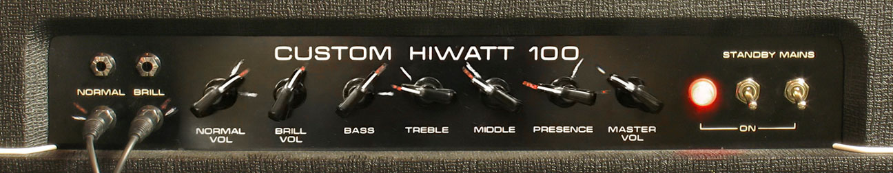<br>
<sub>Source: http://www.kitrae.net/music/David_Gilmour_Amplifiers_and_Speakers.html</sub>

### Kitrae's Reeves Custom 50PS settings for 70s tones
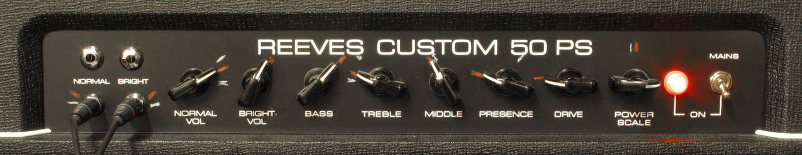<br>
<sub>Source: http://www.kitrae.net/music/David_Gilmour_Amplifiers_and_Speakers.html</sub>

### Kitrae's Custom 100 settings for 1979-2015 tones
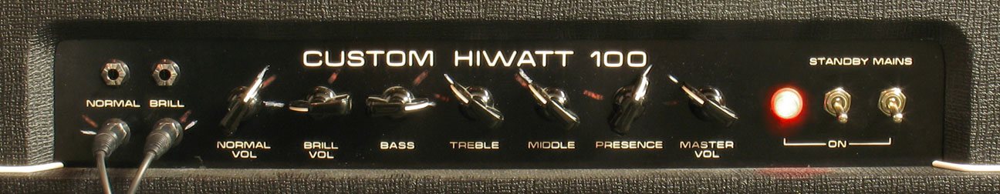<br>
<sub>Source: http://www.kitrae.net/music/David_Gilmour_Amplifiers_and_Speakers.html</sub>

### Kitrae's Reeves Custom 50PS settings for 1979-2015 tones
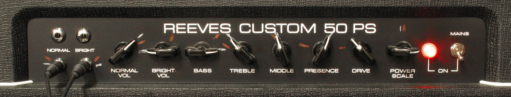<br>
<sub>Source: http://www.kitrae.net/music/David_Gilmour_Amplifiers_and_Speakers.html</sub>

```
These settings should only be used as a starting point since the sound will vary depending on the type of speakers used. He have two of the inputs linked to combine the Normal and Brilliant channels, but he tend to keep the Brill channel volume lower than the Normal. 
```

### Gilmour's Custom 100 settings for Dark Side of the Moon through The Wall era tones
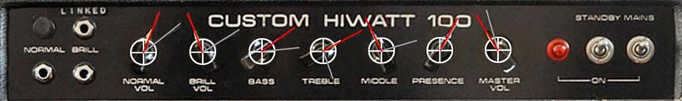<br>
<sub>Source: http://www.kitrae.net/music/David_Gilmour_Hiwatt_Settings.html</sub>

```
There's are actual studio Hiwatt DR-103 settings from the Dark Side of the Moon through The Wall era. The upper normal input and lower brilliant inputs were internally linked, which is why there is a dummy plug in the upper left input.
```

### Gilmour's Custom 100 settings for 2004 Strat Pack tones
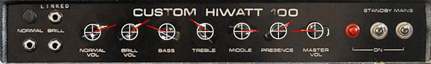<br>
<sub>Source: http://www.kitrae.net/music/David_Gilmour_Hiwatt_Settings.html</sub>

```
One DR-103 head was switched between a WEM 4x12 speaker cabinet and a Marshall 4x12 cab.
```

### Gilmour's Custom 100 settings for 2006 tour tones
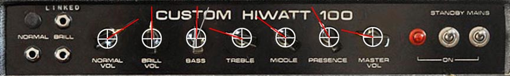<br>
<sub>Source: http://www.kitrae.net/music/David_Gilmour_Hiwatt_Settings.html</sub>

```
Based on the tic marks shown in the photos taken by Pete Cornish when he worked on the amps prior to the tour. The upper normal input and lower brilliant inputs are internally linked. Photos of the amp settings from the tour vary only slightly form these settings. Note that one DR-103 head poweried a Marshall 4x12 speaker cabinet, and another a WEM 4x12 speaker cabinet. Settings were identical except the bass was set slightly higher for the WEM cabinet (gray line). 

Your Hiwatt settings will vary depending on the cabinet type, speaker type, and number of speakers used, so this should only be used as a starting point for your own settings.
```

### Gilmour's Custom 100 settings for 2015/2016 Rattle That Lock tour tones
```
Normal Vol:  2:00
Bril Vol:    12:30
Bass:        3:30
Treble:      8:30
Middle:      1:00
Presence:    9:30
Master Vol:  8:30
```
<sub>Source: http://www.kitrae.net/music/David_Gilmour_Hiwatt_Settings.html</sub>

```
The NORMAL and BRILL high sensitivity inputs are internally linked.
```

### Gilmour's 2014 SA212 settings from Hove studio 

```
Normal Vol:  2:00 tic mark 12:30-1:00)
Bril Vol:    12:00 (tic mark 11:00)
Bass:        1:30 (tic mark 11:00)
Treble:      9:30
Middle:      12:00
Presence:    10:30
Master Vol:  9:00 (tic mark 8:00)
```
<sub>Source: http://www.kitrae.net/music/David_Gilmour_Hiwatt_Settings.html</sub>

```
This is the same amp chassis and the DR103 head, just mounted upside down in the combo, so the inputs are upside down, but David's 212 inputs appear to be linked as if they were right side up, the same as David's Hiwatt heads. They may have been internally linked the same as the heads, but re-wired so that the upper right input is the linked input, since David is familiar with using that one on his Hiwatt heads.
```

### Gilmour's Custom 100 settings for 2006 On an Island tour tones
```
Normal Vol:  2:00
Bril Vol:    1:00
Bass:        11:00
Treble:      10:00
Middle:      1:30
Presence:    3:00
Master Vol:  9:00
```
<sub>Source: http://www.kitrae.net/music/David_Gilmour_Hiwatt_Settings.html</sub>

```
The NORMAL and BRILL high sensitivity inputs are internally linked.
```

### Gilmour's Custom 100 settings for 2006 (1994 tour Hiwatts)

```
Normal Vol:  2:00
Bril Vol:    12:00
Bass:        12:00
Treble:      9:30
Middle:      10:00
Presence:    10:30
Maste Vol:   9:30 -10:00
```
<sub>Source: http://www.kitrae.net/music/David_Gilmour_Hiwatt_Settings.html</sub>

```
The NORMAL and BRILL high sensitivity inputs are internally linked.
``` 

### Gilmour's Custom 100 settings 1994 tour Hiwatts (from magazine photos)
```
Normal Vol:  2:00
Bril Vol:    1:00
Bass:        9:30
Treble:      10:30
Middle:      12:00
Presence:    3:00
Master Vol:  1:30
```
<sub>Source: http://www.kitrae.net/music/David_Gilmour_Hiwatt_Settings.html</sub>

### Gilmour's 1984 era Custom 100 settings (DR103 kept in Brittania Row) 
```
# Red Grease Pencil Marks
Normal Vol:  12:30
Bril Vol:    11:00
Bass:        1:00
Treble:      1:30
Middle:      3:00 (?)
Presence:    1:00 (?)
Master Vol:  11:00
```

```
# White Grease Pencil Marks
Normal Vol:  1:30
Bril Vol:    1:30
Bass:        3:00
Treble:      1:30 (?)
Middle:      3:00
Presence:    1:00
Master Vol:  11:30
```
<sub>Source: http://www.kitrae.net/music/David_Gilmour_Hiwatt_Settings.html</sub>

```
The NORMAL and BRILL high sensitivity inputs (bottom left and right inputs) are linked internally (each with a 1MOhm resistor) to the upper right input, marked LINKED. The upper left input is filled with a dummy plug.
```

### Gilmour's Custom 100 settings for 1980 The Wall concerts (from Cornish photos)
```
Normal Vol:  2:00
Bril Vol:    11:30
Bass:        1:00
Treble:      11:00
Middle:      11:30
Presence:    1:00
Master Vol:  11:00
```
<sub>Source: http://www.kitrae.net/music/David_Gilmour_Hiwatt_Settings.html</sub>

```
The NORMAL and BRILL high sensitivity inputs (bottom left and right inputs) are linked internally (each with a 1MOhm resistor) to the upper right input, marked LINKED. The upper left input is filled with a dummy plug.
```

### Gilour's Custom 100 settings for 1977 tour (pieced together from different, incomplete photos, and the Interstellar Exhibition photos)
```
Normal Vol: 2:00
Bril Vol:   unknown
Bass:       1:30
Treble:     3.00
Middle:     3:00
Presence:   3:00
Master Vol: 2:30 (one photo shows about 10:00-10:30)
```
<sub>Source: http://www.kitrae.net/music/David_Gilmour_Hiwatt_Settings.html</sub>

```
Y cable plugged into upper and lower Brill inputs. Normal inputs taped over.
```

### Gilmour's Custom 100 settings for 1974 tour
```
Normal Vol:  2:00
Bril Vol:    1:00
Bass:        1:00
Treble:      9:30
Middle:      10:00
Presence:    9:30
Master Vol:  9:00
```

## 59 Bassman

### Kitrae's 59 Bassman settings for Strats with EMG pickups, Telecasters, Tube Drivers, Rat, and Big Muffs
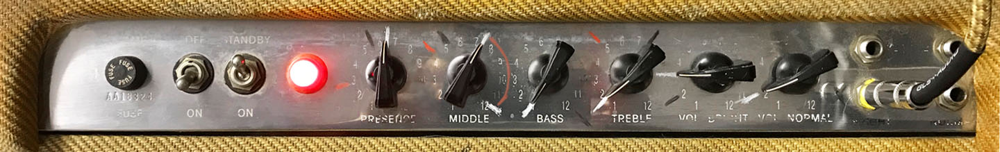<br>
<sub>Source: http://www.kitrae.net/music/David_Gilmour_Amplifiers_and_Speakers.html</sub>

```
He usually dial the Mids knob to maximum with Big Muffs
```

### Kitrae's 59 Bassman settings for Les Paul with P90 pickups and single coil Strats
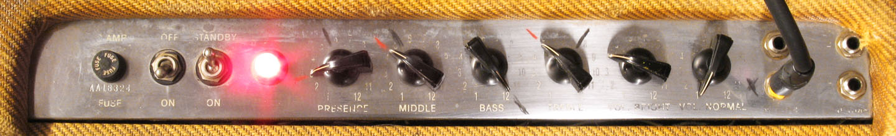<br>
<sub>Source: http://www.kitrae.net/music/David_Gilmour_Amplifiers_and_Speakers.html</sub>

```
He found the Normal, high gain input seems to work best for Gilmour clean and light overdrive tones, but the Bright channel works much better with Big Muffs, or when combining with a Hiwatt. 

If you are plugged into one channel, adjusting the volume of the unused channel affects the volume and tone of the other. In this application, it is best to keep the unused channel volume off. He keep the volume around 3-4.

He experimented linking the inputs on my 59 Bassman but I prefer the sound of only the bright input 1.
```

## Gilmour's Pulse 94 Hiwatt Custom 100 settings 

## RT20

### Gilmourish's RT20 settings for Pulse and Animals tones

## Tube Driver

### Gilmour's Pulse settings
```
# Vintage Chandler Tube Driver #1 (volume boost)
Level: 2:00
Hi:    2:00
Low:   2:00
Drive: 8:00 (o’clock)
```

```
# Vintage Chandler Tube Driver #2 (overdrive)
Level: 11:30
Hi:    11:30
Low:   3:00
Drive: 4:00 (o’clock)
``` 
<sub>Source: https://www.gilmourish.com/?page_id=2119</sub>

## Big Muff

### Gilmourish Rams Head settings for Dogs tone
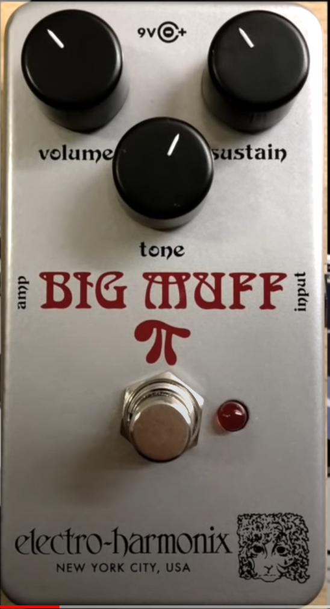<br>
<sub>Source: https://www.youtube.com/watch?v=pfbir_FZ1wI&t=23s</sub>

### Gilmourish Rams Head settings for Pigs tone
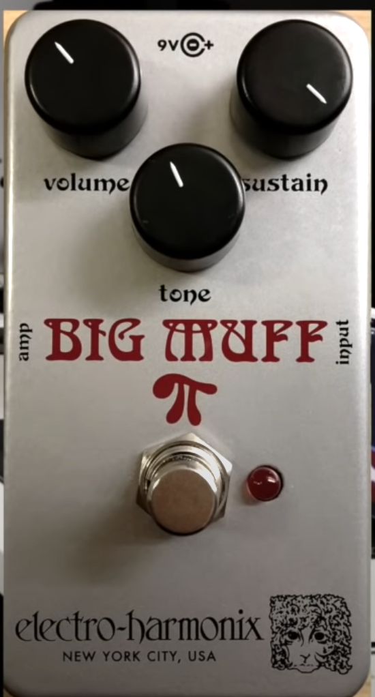<br>
<sub>Source: https://www.youtube.com/watch?v=pfbir_FZ1wI&t=23s</sub>

### Gilmourish Rams Head settings for his random? tone 
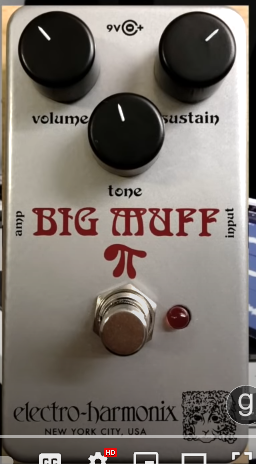<br>
<sub>Source: https://www.youtube.com/watch?v=pfbir_FZ1wI&t=23s</sub>

## Gilmour's Pulse settings
```
Sustain: 70%
Volume:  50-60%
Tone:    20-50%
```
<sub>Source: https://www.gilmourish.com/?page_id=2119</sub>

### Gilmourish's Big Muff Green settings for Sorrow tones

### Gilmourish's Big Muff Green settings for Comfortably Numb tones

### Mustafa Kan Caya Big Muff Green settings for Comfortably Numb tones

## CE-2 

### Gilmour's Pulse settings
```
Speed: 11:00
Depth: 1:00 (o’clock)
```
<sub>Source: https://www.gilmourish.com/?page_id=2119</sub>

### Gilmourish's CE-2 settings for Pulse tones

## Dyna Comp 

### Gilmour's Pulse settings
```
Output:  2:00
Sustain: 10:30 (o’clock)
```
<sub>Source: https://www.gilmourish.com/?page_id=2119</sub>

## CS-2 

### Gilmour's Pulse settings
```
Level:   2:00
Attack:  11:00 
Sustain: 11:30 (o’clock)
```
<sub>Source: https://www.gilmourish.com/?page_id=2119</sub>

### Gilmourish's CS-2 settings for Pulse tones

## Ambi Space

### Kitrae's Plate Reverb settings for Pulse tones

## Signal Chains

### Pulse

```
Keep in mind that all effect settings and setups are based on pictures and video from a certain date and/or interviews and 3rd hand transcriptions that are subject to interpretation. David often make adjustments and may not even be consequent in how he’s using the equipment. This feature should therefore only be used as a guideline for your own setup and not as a gospel. It’s also wise to acknowledge that technique, place and time, studio trickery and who knows what plays a role in David’s tones in addition to the equipment.
```

```
# Shine On Your Crazy Diamond (from Gilmourish)
Stratocaster, neck and bridge pickups
Intro solo:      CS2, DynaComp, EQ “C”, CE2 left channel, Doppolas
Syd’s Theme:     CS2, CE2, EQ “B”, PCM70, CE2 left channel, Doppolas
2nd solo, verse: CS2, Tube Driver #2, TC2290, Doppolas
Outro:           CS2, DynaComp, CE2, TC2290, L.Chorus, Doppolas

# Shine On You Crazy Diamond (from Kitrae)
Intro:               CS-2, MXR Dynacomp, GE-7 A, Vol pedal, CE-2 (left), Doppolas
Syd's Theme:         CS-2, GE-7 B, Vol pedal, CE-2 (mono), PCM 70 Delay (375ms and 500ms), CE-2 (left), Doppolas
Solos and Verse:     CS-2, Tube Driver#2, Vol pedal, TC 2290 Digital Delay (500ms on 2nd solo), CE-2 (left), Doppolas
Outro Arpeggio Riff: CS-2, Tube Driver#2, Vol pedal, TC 2290 Digital Delay (310ms), CE-2 (left), Doppolas

# Astronomy Domine (from Gilmourish)
Telecaster, bridge pickup
Rhythms: CS2, Tube Driver #2, TC2290, CE2 left channel, Doppolas
Solo:    CS2, Tube Driver #2, MXR DDL, TC2290, CE2 left channel, Doppolas

# Astronomy Domine (from Kitrae)
      CS-2, Tube Driver #2, Vol pedal, TC2290 Digital Delay (460ms), CE-2 (left), Doppolas
Solo: CS-2, Tube Driver #2, Vol pedal, MXR Digital Delay II (345ms), TC 2290 Digital Delay (460ms), CE-2 (left), Doppolas

# What Do You Want From Me (from Gilmourish)
Stratocaster, neck and bridge pickups
Rhythms and solos: CS2, RAT, Tube Driver #1, TC2290, CE2 left channel, Doppolas

# What Do you Want From Me? (from Kitrae)
Solo: CS-2, Tube Driver #1, RAT / GE-7, Vol pedal, TC 2290 Digital Delay (540ms), CE-2 (left), Doppolas

# Learning to Fly (from Gilmourish)
Stratocaster, bridge pickup
Rhythms: CS2, Tube Driver #2, TC2290, CE2 left channel

# Learning To Fly (from Kitrae)
Verse, Chorus, Middle Break: CS-2, Tube Driver #2, Vol pedal, TC 2290 Digital Delay, CE-2 (left)
Solo:                        MXR Dynacomp, Cornish ST-2 (gain on max), delay (520ms), chorus

# Keep Talking (from Gilmourish)
Stratocaster, bridge pickup
Rhythms: CS2, DynaComp, CE2, TC2290, CE2 left channel, Doppolas

Keep Talking (from Kitrae)
Intro Delay Time: 450ms/360ms
Verse:            CS-2, Tube Driver #1, RAT / GE-7, Vol pedal, TC 2290 Digital Delay (450ms), CE-2 (left), Doppolas
Solo:             CS-2, Tube Driver #1, RAT / GE-7, Vol pedal, TC 2290 Digital Delay (450ms), CE-2 (left), Doppolas
Talk Box Solo:    CS-2, Tube Driver #1, RAT / GE-7, Vol pedal, TC 2290 Digital Delay, CE-2 (left), Heil Talk Box, Doppolas

# Coming Back to Life (from Gilmourish)
Stratocaster, neck and bridge pickups
Intro solo: CS2, DynaComp, EQ “A”, TC2290, CE2 left channel, Doppolas
Rhythms:    CS2, Tube Driver #2, CE2 left channel, Doppolas
Solos:      CS2, Tube Driver #2, MXR DDL, TC2290, CE2 left channel, Doppolas

# Coming Back To Life (from Kitrae)
Intro: CS-2, MXR Dynacomp, Vol pedal, TC 2290 Digital Delay (650ms), CE-2 (left), Doppolass
Verse: CS-2, Tube Driver #2, Vol pedal, CE-2 (left), Doppolas
Solos: SPC=4-5, CS-2, MXR Dynacomp, Tube Driver #2, Vol pedal, MXR Digital Delay II (360ms?),
TC 2290 Digital Delay (650ms), CE-2 (left), Doppolas
Solo Alternate: MXR Dynacomp, Tube Driver #2, Vol pedal, MXR Digital Delay II (360ms?), TC 2290 Digital Delay (650ms), CE-2 (left), Doppolas

# Hey You (from Gilmourish)
Stratocaster, bridge pickup
Rhythms: Sovtek Big Muff, TC2290, CE2 left channel, Doppolas
Solo:    CS2, Sovtek Big Muff, Tube Driver #1, TC2290, CE2 left channel, Doppolas

# Take it back (from Kitrae)
Rhythm: CS-2, MXR Dynacomp, Tube Driver #1, Vol pedal, TC 2290 Digital Delay (410ms), CE-2 (left), Doppolas
Solo:   Tube Driver #1, Sovtek Big Muff, Vol pedal, TC 2290 Digital Delay (410ms), CE-2 (left), Doppolas

# Poles Apart (from Kitrae)
Solo: CS-2, MXR Dynacomp, Pete Cornish SS-2, Tube Driver #2, Vol pedal, TC 2290 Digital Delay (400ms), CE-2 (left), Doppolas

# A Great Day for Freedom (from Gilmourish)
Stratocaster, neck pickup
Rhythms and solo: CS2, Dynacomp, SS2, Tube Driver #2, TC2290, CE2 left channel, Doppolas

# A Great Day For Freedom (from Kitrae)
Verse:          CS-2, MXR Dynacomp, Tube Driver #1, Pete Cornish SS-2, Vol pedal, CE-2 (left), Doppolas
Solo:           MXR Dynacomp, Pete Cornish SS-2,Tube Driver #2, Vol pedal, TC 2290 Digital Delay (680ms), CE-2 (left), Doppolas
Solo Alternate: CS-2, MXR Dynacomp, Pete Cornish SS-2,Tube Driver #2, Vol pedal, TC 2290 Digital Delay (680ms), CE-2 (left), Doppolas

# Sorrow (from Gilmourish)
Stratocaster, bridge pickup
Intro:   Sovtek Big Muff, Tube Driver #1, EQ “A”, TC2290, CE2 left channel, Doppolas
Rhythms: Sovtek Big Muff, Tube Driver #1, TC2290, CE2 left channel, Doppolas
Solo:    CS2, Sovtek Big Muff, Tube Driver #1, TC2290, CE2 left channel, Doppolas

# Sorrow (from Kitrae)
Intro: SPC=10,Tube Driver #1, Sovtek Big Muff, GE-7 A, Vol pedal, TC 2290 Digital Delay (630ms), CE-2 (left), Doppolas
Verse, First Solo, Chorus, Middle Break: SPC=5, Tube Driver #1, Sovtek Big Muff, Vol pedal, TC 2290 Digital Delay (630ms), CE-2 (left), Doppolas
Outro Solo: SPC=5, CS-2, Tube Driver #1, Sovtek Big Muff, Vol pedal, TC 2290 Digital Delay (560ms), CE-2 (left), Doppolas
Outro: SPC=10, Tube Driver #1, Sovtek Big Muff, GE-7 A, Vol pedal, TC 2290 Digital Delay (630ms), CE-2 (left), Doppolas
Outro Alternate: SPC=10, Tube Driver #1, Pete Cornish SS-2, Sovtek Big Muff, GE-7 A, Vol pedal, TC 2290 Digital Delay (630ms), CE-2 (left), Doppolas

# On The Turning Away (from Kitrae)
Verse:              Tube Driver #2, Vol pedal, TC 2290 Digital Delay, CE-2 (left), Doppolas
Solo Patches:       CS-2, Tube Driver #1, Sovtek Big Muff, Vol pedal, TC 2290 Digital Delay (540ms), CE-2 (left), Doppolas
Solo (alternate):   Tube Driver #1, Sovtek Big Muff, Vol pedal, TC 2290 Digital Delay (540ms), CE-2 (left), Doppolas
Solo (alternate 2): MXR Dynacomp, Tube Driver #1, Sovtek Big Muff, Vol pedal, TC 2290 Digital Delay (540ms) (dry defeat LED lit), CE-2 (left), Doppolas
 
# High Hopes (from Gilmourish)
Acoustic nylon string, Jedson lap steel
Slide: CS2, Tube Driver #2, TC2290, CE2 left channel, Doppolas

# High Hopes (from Kitrae)
Verse Acoustic: CS-2, MXR Dynacomp, Vol pedal, CE-2 (left)
Solo:           CS-2, Tube Driver #2, Vol pedal, TC 2290 Digital Delay (420ms), CE-2 (left), Doppolas

# Another Brick in the Wall (part 2) (from Gilmourish)
Stratocaster, neck pickup
Intro:          CS2, Dynacomp, CE2, EQ “B”, TC2290, CE2 left channel, Doppolas
Rhythms verse:  CS2, Dynacomp, CE2 left channel, Doppolas
Rhythms chorus: CS2, Tube Driver #2, TC2290, CE2 left channel, Doppolas
Solo:           CS2, Tube Driver #2, TC2290, CE2 left channel, Doppolas

# Another Brick in the Wall Part II (from Kitrae)
Intro (ABITW Part I): CS-2, MXR Dynacomp, CE-2 (mono), Vol pedal, TC 2290 Digital Delay (440ms), CE-2 (left), Doppolas
Rhythm: CS-2, MXR Dynacomp, Vol pedal, TC 2290 Digital Delay, Doppolas
Solo: CS-2, Tube Driver #2, Vol pedal, TC 2290 Digital Delay (540ms), CE-2 (left), Doppolas
Solo (alternate): CS-2, MXR Dynacomp, Tube Driver #2, CE-2 (mono), Vol pedal, TC 2290 Digital Delay (540ms), CE-2 (left), Doppolas

# Breathe/Breathe (reprise) (from Gilmourish)
Stratocaster, bridge pickup
CS2, Tube Driver #1, UniVibe, TC2290, CE2 left channel, Doppolas

# Breathe (from Kitrae)
Chords / Arpeggios: CS-2, Tube Driver #1, UniVibe, Vol pedal, TC 2290 Digital Delay (480ms)

# One Of These Days (from Kitrae)
Slide Solos:     CS-2, Tube Driver #1, Sovtek Big Muff, Vol pedal, TC 2290 Digital Delay (300ms), CE-2 (left), Doppolas
Solos Alternate: Tube Driver #1, Sovtek Big Muff, Vol pedal, TC 2290 Digital Delay (300-310ms), CE-2 (left) 

# Time (from Gilmourish)
Stratocaster, mid and bridge pickups
Intro:   CS2, CP9, CE2, TC2290, PCM70, CE2 left channel, Doppolas
Rhythms: Tube Driver #2, TC2290, CE2 left channel, Doppolas
Solo:    P2 Big Muff, Tube Driver #2, UniVibe, TC2290, CE2 left channel, Doppolas

# Time (from Kitrae)
Intro: MXR Dynacomp, Ibanez CP-9, CE-2 (mono), GE-7 B, Vol pedal, TC 2290 Digital Delay (470ms), PCM 70 Delay (94ms)
Verse / Chorus: Tube Driver #2, TC 2290 Digital Delay (430ms)
Solo: Sovtek Big Muff, Tube Driver #2, UniVibe, Vol pedal, TC 2290 Digital Delay (430ms)
Solo Alternate: Pete Cornish P-2, Tube Driver #2, UniVibe, Vol pedal, TC 2290 Digital Delay (430ms)
Solo Alternate 2: Pete Cornish P-2, Tube Driver #2, UniVibe, Vol pedal, TC 2290 Digital Delay (430ms), CE-2 (left), Doppolas
Chorus/Home Again Section: CS-2, Tube Driver #1, UniVibe, Vol pedal, TC 2290 Digital Delay, CE-2 (left), Doppolas

# The Great Gig in the Sky (from Gilmourish)
Jedson lap steel
Slides: CS2, Dynacomp, EQ “B”, TC2290, CE2 left channel, Doppolas

# Money (from Gilmourish)
Stratocaster, bridge pickup
Rhythms:          SS2, Tube Driver #2, CE2 left channel
1st and 3rd solo: CS2, Sovtek Big Muff, Tube Driver #1, TC2290, CE2 left channel
2nd solo:         RAT, Tube Driver #1, CE2 left channel, Doppolas

# Us & Them (from Gilmourish)
Stratocaster, neck pickup
Rhythms verse:  CS2, Tube Driver #1, TC2290, CE2 left channel, Doppolas
Rhythms chorus: CS2, Tube Driver #1, Tube Driver #2, TC2290, CE2 left channel, Doppolas

# Any Colour You Like (from Gilmourish)
Stratocaster, neck pickup
Rhythms: CS2, Tube Driver #1, CLS222, CE2 left channel, Doppolas
Solo:    CS2, Tube Driver #1, Tube Driver #2, CLS222, TC2290, CE2 left channel, Doppolas

# Brain Damage (from Gilmourish)
Stratocaster, neck pickup
Rhythms: CS2, Tube Driver #1, CLS222, TC2290, CE2 left channel, Doppolas

# Eclipse (from Gilmourish)
Stratocaster, neck pickup
Rhythms: CS2, Tube Driver #1, CLS222, TC2290, CE2 left channel, Doppolas

# Marooned (from Kitrae)
It is known that David used the IPS33-B and an Ernie Ball expression pedal, but I guessed at the rest.
CS-2, IPS33B and Ernie ball expressions pedal, Tube Driver #2, Volume pedal, TC 2290 Digital Delay (500ms), CE-2 (left), Doppolas

# Comfortably Numb (from Gilmourish)
Stratocaster, bridge pickup
Rhythms and 1st solo: Sovtek Big Muff, Tube Driver #1, TC2290, CE2 left channel, Doppolas
2nd solo:             CS2, Sovtek Big Muff, Tube Driver #1, TC2290, CE2 left channel, Doppolas
2nd solo “waving”:    CS2, Sovtek Big Muff, Tube Driver #1, TC2290, MXR DDL CE2 left channel, Doppolas

# Run Like Hell (from Gilmourish)
Telecaster, bridge pickup
CS2, CE2, CE2 left channel, Doppolas
```
<sub>Source: https://www.gilmourish.com/?page_id=2119 and http://www.kitrae.net/music/David_Gilmour_Tone_Building_1B.html</sub>

# Josh (QOTSA 2013 Like Clockwork)

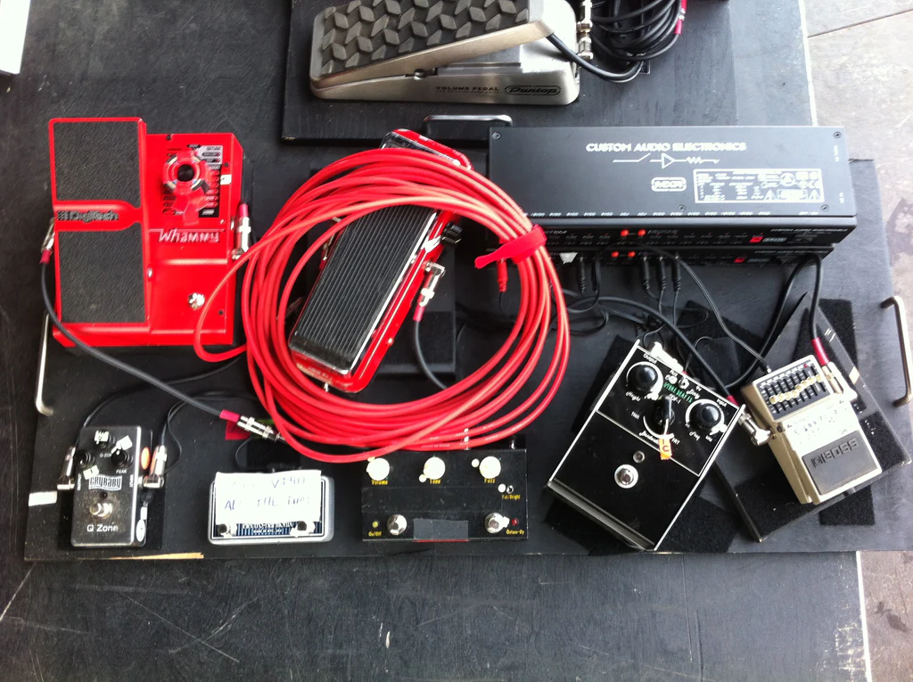<br>
<sub>Source: https://en.customboards.fi/blogs/articles/josh-homme-s-pedals-amplifiers-and-guitars-in-the-spotlight</sub>

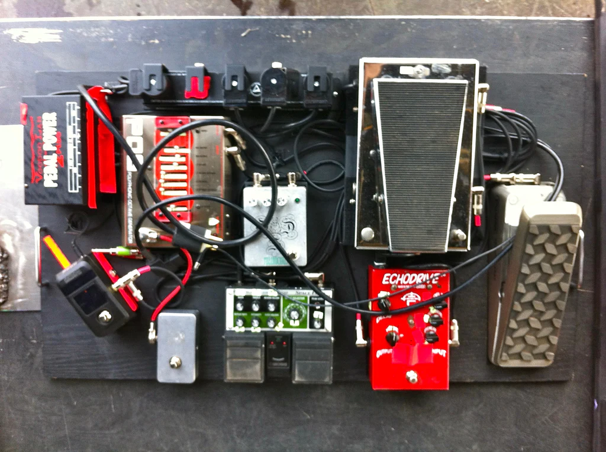<br>
<sub>Source: https://en.customboards.fi/blogs/articles/josh-homme-s-pedals-amplifiers-and-guitars-in-the-spotlight</sub>

# Josh (TCV)

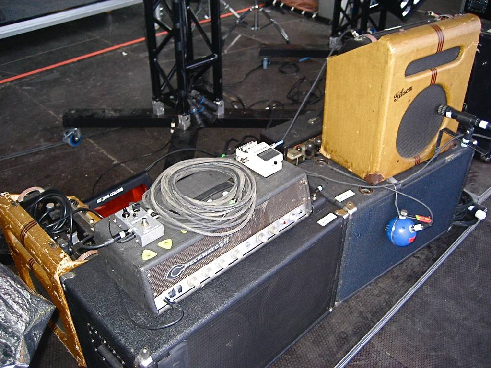<br>
<sub>Source: https://en.customboards.fi/blogs/articles/josh-homme-s-pedals-amplifiers-and-guitars-in-the-spotlight</sub>

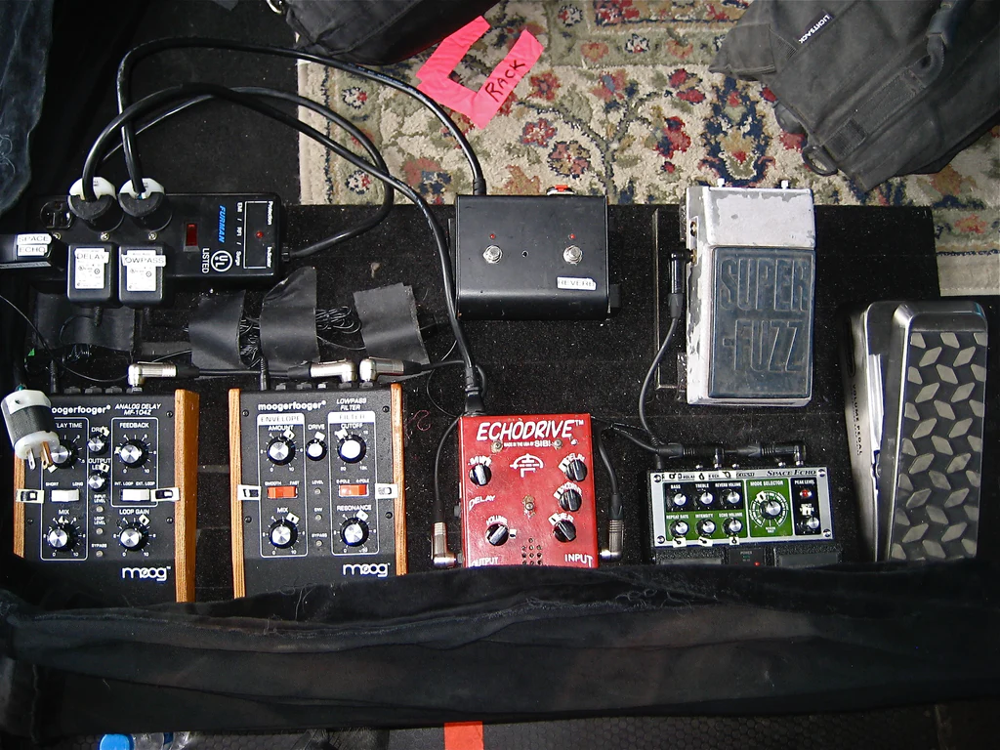<br>
<sub>Source: https://en.customboards.fi/blogs/articles/josh-homme-s-pedals-amplifiers-and-guitars-in-the-spotlight</sub>

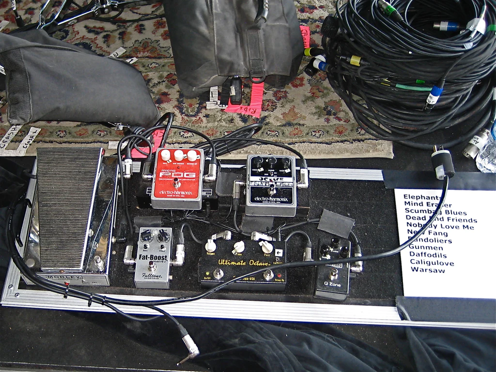<br>
<sub>Source: https://en.customboards.fi/blogs/articles/josh-homme-s-pedals-amplifiers-and-guitars-in-the-spotlight</sub>